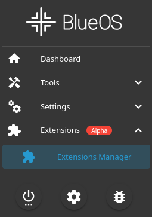
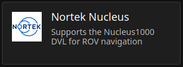
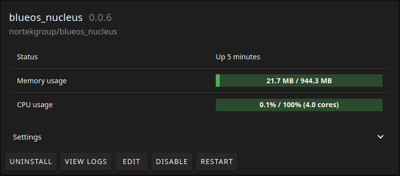
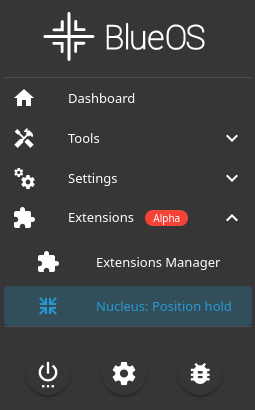

# BlueOS extension

## BETA

This extension is currently under active development, with ongoing enhancements aimed at providing full support for AUTO and GUIDED modes in the BlueROV2.

As such, any release from version 2.0.0 onward should be considered a BETA version. While we strive for stability and usability, new features may still be in progress and occasional issues may arise.

If you encounter unexpected behavior or problems with a new release, please don’t hesitate to contact our [support](https://support.nortekgroup.com) team. Your feedback is invaluable in helping us improve the extension.

## Intro

This is a Nucleus extension for the BlueOS software running on BlueROV2. 

It works by wrapping the Nucleus Driver in a docker image, with a script that feeds velocity data from the Nucleus device into the ArduSub control system through mavlink commands.

This allows the user to utilize the "position hold", "auto" and "guided" functionality in the ROV. "auto" and "guided" require the Nucleus to have the INS license in order to work.

## Nortek Nucleus integration

To mount the Nucleus unto the BlueROV2 and connect it to its network, refer Nortek's [Nucleus integration guide](https://support.nortekgroup.com/hc/en-us/articles/8246995934748-Nucleus-integration-with-BlueROV2).

## setup

### BlueOS

BlueOS needs to be of version 1.2.6 or newer in order to support the adding of third party extensions.

### ArduSub

ArduSub needs to be of version 4.1.2 or newer for it to support the mavlink packets used to send data from the Nucleus.

The current version of the extension is developed on ArduSub version 4.5.0 and it is recommended to use at least this version of ArduSub.

### Nucleus

This extension assumes that the Nucleus is connected to the network of the ROV through an ethernet connection. It is therefore necessary to set a static IP in the Nucleus.

The network prefix of the BlueROV2 is 192.168.2.0, with a netmask of 255.255.255.0. The Nucleus' static IP must therefore be set to a fitting value, i.e. 192.168.2.201. 

In the GUI that comes with the extension the user must specify this IP address to establish a connection with the Nucleus device. The user is therefore not limited to using this IP address, but is at the same time responsible of selecting an IP address that is not already in use on the network.

## Adding extension to BlueROV2

The extension can be added to the BlueROV2 either through the BlueOS software, or by creating the docker image on the onboard computer and running the docker container directly.

It is recommended to add the extension through BlueOS as it is both easier and the intended way for this extension to be added. The two different approaches are covered in the following subsections.

### BlueOS

#### Installation
The extension can be added through BlueOS' extensions menu.

Navigate to Extensions > Extensions Manager.

Locate Nortek Nucleus under the tab "STORE" and open it.

When the Nortek Nucleus extension is opened the user will be presented with this README, as well as information about the extensions creator, a link to this github repository, the settings in the docker image of the extension and the option of installing the extension.

To install the extension, select the newest available version in the drop down menu (the newest version should be the default) and push install. BlueOS will the pull the nucleus extension docker image and install it in its extensions.

#### Usage

After the installation has been completed. The extension can be located in Extensions > Extensions Manager, under the tab "INSTALLED".

Here the user have the option to edit sittings, uninstall, disable and restart the extension. It is also possible to view the output logs from the docker container that runs the extension which can serve as a good debugging tool.

The extension itself can be opened in the menu by navigating to Extensions > Nucleus: Position hold. 

Opening this will present the user with the GUI for the Nucleus extension which is covered in [Using the extension](#using-the-extension)

## Using the extension

Read the whole section before using the extension, there are critical settings for good performance described in the end.

**N.B.** In order for the extension to work it is necessary to change certain controller parameters. Refer to "Controller parameters" section for more info

**N.B.** In order for the "position hold", "auto" and "guided" algorithm to perform well it might be necessary to change the ROV's PID parameters. Refer to "PID parameters" section for more info

**N.B.** In order to use the "auto" and "guided" features of the ROV, it is necessary for the Nucleus to output INS data, i.e. it needs to have an INS license.

### GUI

With the extension added, its user interface (GUI) can be found by navigating to Extensions -> Nucleus in the BlueOS menu.

The GUI presents the user with a home page that contains the relevant information for the extension

The settings field is used to connect to the nucleus by specifying its hostname, i.e. `192.168.2.201`, and whether the extension should be enabled. If not enabled, the extension will still read and handle packets sent from the Nucleus, but it will not send any mavlink messages to the ROV. This means that if the Nucleus is connected and running, but it is not enabled, from the ROV's point of view the extension might as well not be present.

The status field contains information about certain checks that has to be OK in order for the extension to work properly. If any of these are not OK, it is unlikely that the ROV will receive any mavlink messages from the extension. If either `heartbeat` or `cable guy` is not OK, power cycle the ROV. If either `connected` or `configured` is not OK, (re)connect the Nucleus. If `GPS origin set` is not Ok, the ROV has not received its initial position, which is necessary in order to use the "auto" and "guided" feature. Set the GPS origin with the map in the GUI.

The packet counter keeps track of the packets sent to the ROV. "Sent" count how many packets where successfully sent, "Failed" count how many packets that failed to be sent, and "Skipped" count how many packets has not been sent, due to the extension not being enabled. Verifying that the "Sent" packet counter is increasing is a good indication that the extension is working.

Set vehicle location is used to set the latitude and longitude position in the ROV, and provides the initial position for the ROV when using the "auto" and "guided" features. Upon setting the vehicle location, the user should see the ROV move to the specified position in the map in QGroundControl.

**N.B.** ArduSub only allows for setting the gps origin **ONLY ONCE(!)**. If GPS origin is incorrectly set, the user unfortunately has to power cycle the ROV.

**N.B.** In order for the map to be visible in the user interface, internet is required.

#### Start up procedure

This is a recommended procedure for using the extension in order to use the "auto" feature:

1. Power on the ROV
2. If not already running, start the extension
3. Open the extension GUI
4. Open QGroundControl
5. launch the ROV
6. Drive the ROV to its initial position
7. Set the vehicle position through the GUI (make sure you do this successfully on the first try)
8. Connect to the Nucleus through the GUI

With the initial position correctly set, and with the Nucleus streaming data to the ROV, you should now be able to see the ROV being correctly tracked in the QGroundControl map.

The ROV is now ready to use the "auto" and "guided" feature.

In order to use the "position hold" feature one simply has to connect the Nucleus through the GUI. This feature is not sensitive to properly setting up the ROV's initial position.

### PID parameters

**N.B.** Adjusting any of these parameters **WILL** change the behavior of the ROV

**N.B.** The ROV will not remember the original values of these parameters in case they are changed. It is therefore the users responsibility to remember the original values in case they wish to revert back to the original parameterization.

The PID parameters can be changed through the "Autopilot parameters" menu in the blueos.local home page. Good parameterization is necessary for a good performance of the ROV. The correct parameters varies from vehicle to vehicle as the physical attributes of the ROV has an impact on its behavior. However, recommended starting parameters for a standard BlueROV2 with only the Nucleus being the third party installation are as follows:

| Parameter | Value |
| ---| --- |
| PSC_POSXY_P | 1.0 |
| PSC_POSZ_P | 1.0 |
| PSC_VELXY_P | 5.0 |
| PSC_VELXY_I | 0.5 |
| PSC_VELXY_D | 0.8 |
| PSC_VELZ_P | 5.0 |

While these parameters might provide a well performing ROV, they are most likely not optimal. It is recommended to adjust these parameters to get the desired ROV behavior.

### Controller parameters

**N.B.** Adjusting any of these parameters may change the behavior of the ROV

**N.B.** The ROV will not remember the original values of these parameters in case they are changed. It is therefore the users responsibility to remember the original values in case they wish to revert back to the original parameterization.

In order for the controller to accept and utilize the velocity and position packets sent from the Nucleus, certain parameters has to be changed. The parameters can be changed in the "Autopilot parameters" menu in the blueos.local home page. 

After these parameters has been changed it is necessary to power cycle the vehicle for these parameters to take effect

The parameters and their required values are the following

| Parameter | Value |
| ---| --- |
| SERIAL0_PROTOCOL | MAVLink2 |
| EK3_ENABLE | Enabled |
| AHRS_EKF_TYPE | Enable EKF3 |
| EK2_ENABLE | Disable |
| VISO_TYPE | MAVLink |
| EK3_SRC1_POSXY | ExternalNav |
| EK3_SRC1_VELXY | ExternalNav |
| EK3_SRC1_YAW | ExternalN |
| EK3_SRC2_YAW | Compass |

Also, EK3 algorithm in the ROV may struggle in "auto" mode in terms of selecting the appropriate estimated positions. This has become apparent in testing and its noticed with "EKf3 lane switch" errors. As well as jumps in the estimated position which can be seen in the ROVs position in QGroundControl.

If this is happening, a dirty fix is to adjust the "EKF3 Lane Relative Error Sensitivity Threshold", which is the threshold for how much error there can be in the estimates before the algorithm changes the "lane". By increasing this value the algorithm is less likely to change lanes while running and is likely to yield a better performance as these lane changes causes quite big jump it the estimate positions.

During testing there were good results by setting this value to its maximum, that is:

| Parameter | Value |
| ---| --- |
| EK3_ERR_THRESH | 1.0 |